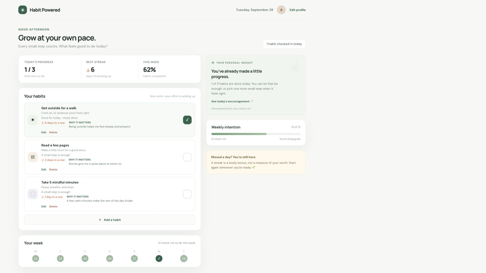

# Habit Powered — Personalized Habit Tracker

Habit Powered helps you build routines with small, repeatable steps. Check in each day, see your streaks grow, and get supportive reflections on the progress you have made.

I built Habit Powered around a positive feedback loop: celebrate showing up, make progress easy to see, and make it comfortable to begin again after a missed day. It is designed for people who want a personal habit tracker that encourages consistency without treating a streak as a measure of worth.




## Current Status

Current status: Working browser-based MVP. Habit details and check-ins are saved in the current browser with `localStorage`; there is no account or cross-device sync.

Insights: Personalized encouragement responds to recent check-ins using simple rules and templates. The current version does not call an AI model.

Stack: HTML, CSS, JavaScript, browser `localStorage`

## Getting Started

From the project root, start a local preview:

```sh
python3 -m http.server 4173 --directory site-source/dist
```

Open [http://localhost:4173](http://localhost:4173) in your browser.

## Features (v1)

- Create habits with a name and optional description
- Edit a habit’s name and description while keeping its check-in history
- Delete a habit after confirming; deleting also removes that habit’s history
- Check in each day and see current and best streaks
- Review completion across the last seven days and see weekly progress
- Get supportive, activity-based encouragement, including after missed days
- Keep habits and progress in this browser between visits

## Roadmap

- Add optional AI-generated coaching grounded in a person’s habit history
- Add reminders that can be adjusted to each person’s routine
- Explore private sync across devices

## Project Structure

```text
.
├── README.md
├── dist/
│   └── index.html                 # Workspace copy of the app
├── .openai/
│   └── hosting.json               # Site identity and static output settings
└── site-source/
    ├── .openai/
    │   └── hosting.json           # Site source configuration
    └── dist/
        └── index.html             # Deployed app source
```

## About

Habit Powered is a personal habit tracker for steady, self-directed growth. Its streaks celebrate consistency; its messages leave room for real life.
